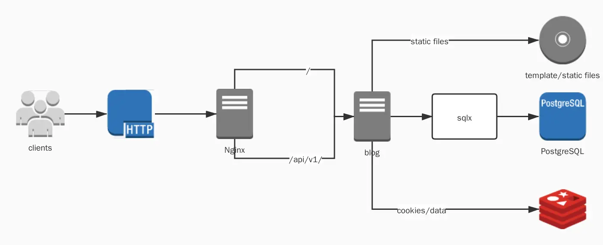

## About

This is my personal blog.

## Architecture



## Status

- [ ] The third-party login function of Github is in disrepair for a long time, and the api seems 
  to be deprecated, and there is no time to rewrite it for the time being
- [ ] js uses a very old technology (I'm not familiar with the front-end technology)

## Dependences
- Redis
- Postgresql

## Getting Started

### [Rust](https://www.rust-lang.org/)

```
$ curl https://sh.rustup.rs -sSf | sh
```

### [Sqlx Cli](https://github.com/launchbadge/sqlx)
This project use sqlx as Orm framework, so you need to install its command line tool via Rust package manager(eg, Cargo)
```bash
$ cargo install sqlx-cli
```

### [Postgresql](https://www.postgresql.org/)
Use docker images

#### Install from docker-hub
```bash
$ docker pull postgres
$ docker run --name your_container_name -e POSTGRES_PASSWORD=system -d -p 5432:5432 postgres
```

#### If you want to enter psql interactive command line
```bash
$ docker run -it --rm --link your_container_name:postgres postgres psql -h postgres -U postgres
```

#### init database
```bash
$ sqlx database create
$ sqlx migrate run
```

### [Redis](https://github.com/redis/redis)
Use docker images

```bash
$ docker pull redis
$ docker run --name redis -p 6379:6379 -d redis
```

### [Nginx](http://nginx.org/en/download.html)
nginx is only used when deploying production

##### config:
```
server {
        listen       80;
        server_name  127.0.0.1;

        location / {
            proxy_pass http://127.0.0.1:8080;
            proxy_redirect off;
            proxy_set_header Host $host;
            proxy_set_header X-Real-IP $remote_addr;
            proxy_set_header X-Forwarded-For $proxy_add_x_forwarded_for;
        }

        location /api/v1 {
            proxy_pass http://127.0.0.1:8080;
            proxy_redirect off;
            proxy_set_header Host $host;
            proxy_set_header X-Real-IP $remote_addr;
            proxy_set_header X-Forwarded-For $proxy_add_x_forwarded_for;
        }
```

### blog
```
$ cargo run --release // listen on 127.0.0.1:8080
```

if you want to login admin, the account is `admin`, password is `admin`
