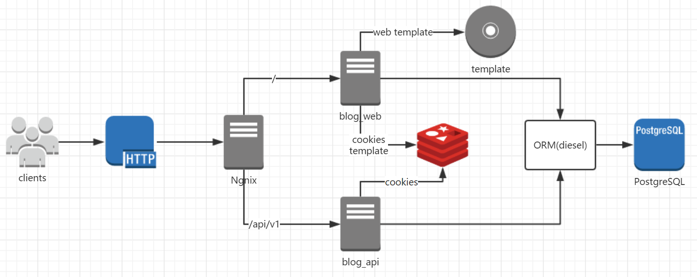

## About

This is my personal blog.

## Architecture



## Dependences
- Redis
- Postgresql

## Getting Started

### [Rust](https://www.rust-lang.org/)

```
$ curl https://sh.rustup.rs -sSf | sh
```

### [Diesel Cli](https://github.com/diesel-rs/diesel)
This project use Diesel as Orm framework, so you need to install its command line tool via Rust package manager(eg, Cargo)
```
$ cargo install diesel_cli --no-default-features --features postgres --vers 0.16.0
```

### [Postgresql](https://www.postgresql.org/)
you need to install Postgresql database, and then configure postgresql by following document’s guide

#### Install the corresponding version of contrib
```
$ yum install postgresql96-contrib
```

#### init database
```
$ diesel migration run
```

### [Nginx](http://nginx.org/en/download.html)
nginx has been used in the development of the time

##### config:
```
server {
        listen       8880;
        server_name  127.0.0.1;

        location / {
            proxy_pass http://127.0.0.1:8080;
            proxy_redirect off;
            proxy_set_header Host $host;
            proxy_set_header X-Real-IP $remote_addr;
            proxy_set_header X-Forwarded-For $proxy_add_x_forwarded_for;
        }

        location /api/v1/ {
            proxy_pass http://127.0.0.1:8888/;
            proxy_redirect off;
            proxy_set_header Host $host;
            proxy_set_header X-Real-IP $remote_addr;
            proxy_set_header X-Forwarded-For $proxy_add_x_forwarded_for;
        }
```

### blog
```
$ cargo run --bin blog_web // listen on 127.0.0.1:8080

$ cargo run --bin blog_api // listen on 127.0.0.1:8888
```

if you want to login admin, the account is `admin`, password is `admin`
